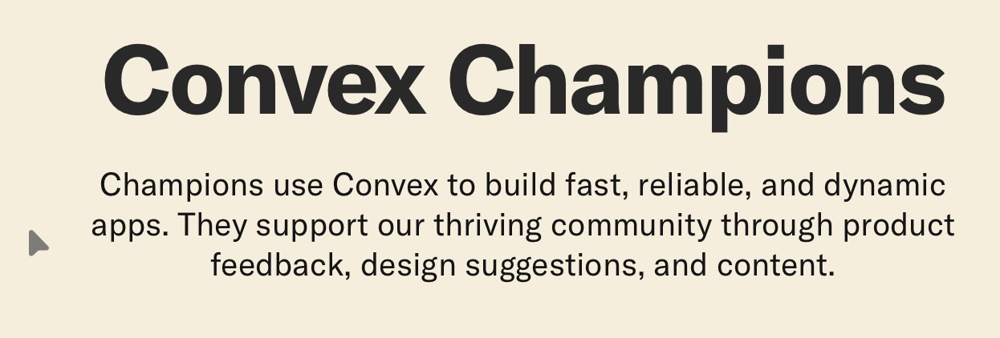

+++
title = "I'm now a Convex Champion"
description = "I've already been advocating for Convex, why not do it as a Champion?"
date = 2026-05-15
slug = "convex-champion"

[taxonomies]
tags = ["Software Engineering"]

[extra]
display_published = true
+++

### I'm now a Convex Champion

I just became a Convex Champion, and I'm pretty stoked about it.

<a href="https://www.convex.dev/">Convex</a> is a reactive database for building
modern web apps. I built <a href="./convex-multiplayer-game">
    a small multiplayer online game
</a> with it and was really impressed by the developer experience.

Since then, I’ve been advocating for Convex as a fan: <a href='../convex-multiplayer-game-talk'>I gave two community talks about it</a>, <a href='https://youtu.be/m72lrbINkak'>published a YouTube tutorial</a>, did some docs improvements in their repo (<a href='https://github.com/get-convex/convex-backend/pull/133'>1</a>, <a href='https://github.com/get-convex/convex-backend/pull/124'>2</a>), and <a href='https://github.com/get-convex/convex-backend/pull/165'>even fixed a self-hosting bug</a>.

So when they reached out to me about this program, my immediate thought was: I’ve already been advocating for Convex. Why not do it as a Champion?

<a href="https://www.convex.dev/champions">Convex Champions</a> is an amazing
program that brings together people who are interested in Convex. It also comes
with some pretty cool benefits, so make sure to check it out. Thanks to everyone
on the Convex team for inviting me into this community and for building such an
amazing product!
