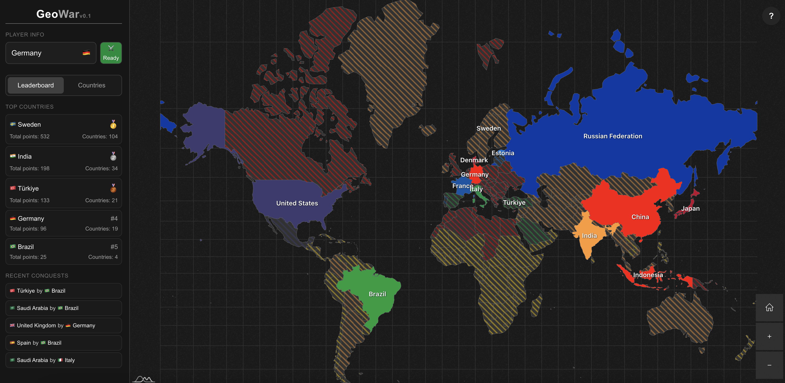
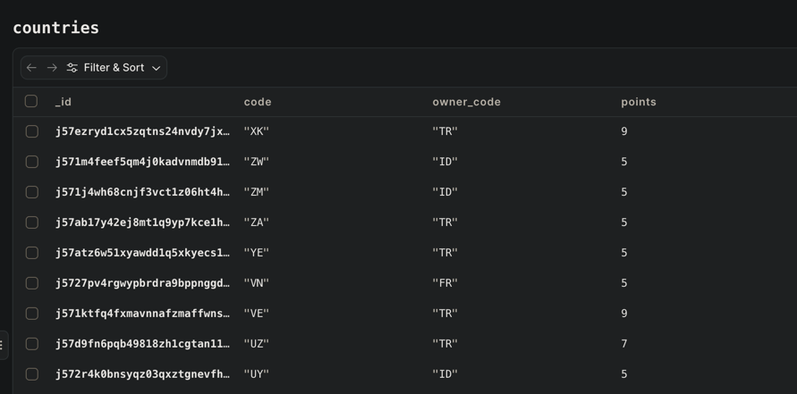
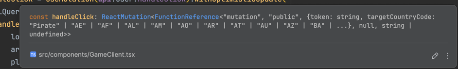

+++
title = "Building a Multiplayer Game with Convex Over a Weekend"
description = "I built a multiplayer game with Convex over a weekend. Here's how I did it."
date = 2025-07-28
slug = "convex-multiplayer-game"

[taxonomies]
tags = ["Projects"]

[extra]
display_published = true
+++


I first heard about [Convex](https://www.convex.dev/) through [t3.chat](https://t3.chat/) months ago, and ever since
then, it's been buried deep in my "someday"
learning list.
When I finally had a weekend to nerd out, I decided to give it a go.
I already had an app idea in mind that seemed like a perfect fit for Convex: a real-time, multiplayer browser clicker
game.
A small homage to [eRepublik](https://www.erepublik.com/en), which I loved playing as a kid.

In this article, I will share my experience building a multiplayer game with Convex over a weekend, walking you through the steps I took, the challenges I faced, and the solutions I found. 
During which we will cover the basics of Convex.

### What's the Project?


*Ah yes, the Swedish Empire where the sun never sets*

This was the end result: [GeoWar.io](https://www.geowar.io/), a game based on world conquest.
The rules are simple, you automatically get assigned to your country of origin.
You either defend or attack a territory by clicking on it.
Each territory has a point of its own and if you reduce a territory's points to zero, you conquer it.
Countries that are currently invaded are marked with stripes.

The entire backend is built with Convex. The frontend is built with [Next.js](https://nextjs.org/) and the map is made with [amcharts](https://www.amcharts.com/).

### What even is Convex?

Convex gives you a backend entirely with TypeScript, including database, backend functions, authentication and real-time
syncing.
No servers, no REST APIs, no manual WebSockets.
End-to-end type safety makes for a great developer experience.
It also has an extensive set of libraries that help you to build your app faster.

Building with Convex instead of a traditional backend allowed me to focus on the game logic instead of struggling with boilerplate code.

### Our first schema

Convex stores JSON-like documents and can be used with or without a schema. Here's an example schema from my database, I
simplified it a bit to focus on the core concepts:

```ts
// convex/schema.ts

import {defineSchema, defineTable} from 'convex/server';
import {v} from 'convex/values';

export default defineSchema({
    countries: defineTable({
        name: v.string(), // Name of the country
        points: v.number(), // If the point reaches 0, the country gets conquered
        code: v.union( // ISO 3166-1 alpha-2 country code
            v.literal('DE'),
            v.literal('US')
            // ... other countries
        ),
    }).index('by_code', ['code']), // An index by country code
    // ... other schemas
})
```

The validator builder ```v``` is used to define the type of documents in each table. It supports various simple types,
as well as more complex structures like string literals, records or optional fields.


*What the schema above looks like in Convex Dashboard*

We interact with our database through **mutations** and **queries**.

**Mutations** are used to make changes to data in the database.
They can also handle authentication checks or other business logic, and may return a response to the client.

**Queries** are the core of your backend API.
They retrieve data from the database, optionally perform authentication or business logic, and return the result to the
client.

### Mutating data

Let's start with a mutation.
Again, this is a simplified version of a real code snippet.

```ts
// convex/user.ts

import {mutation} from './_generated/server';
import {v} from 'convex/values';

export const handleClick = mutation({
    args: {
        targetCountryCode: v.union(
            v.literal('DE'),
            v.literal('US'),
            // ... other countries
        ),
    },
    handler: async (ctx, args) => {
        // Get the corresponding country
        const targetCountry = await ctx.db
            .query('countries')
            .withIndex('by_code', (q) => q.eq('code', args.targetCountryCode))
            .first();

        // Rest of the business logic removed for simplicity

        // Update the country's points
        await ctx.db.patch(targetCountry._id, {
            points: targetCountry.points - 1,
        });
    },
});
```

Let's break down what's happening here:

- We created a new public **mutation**, which gets exposed automatically.
- **args** takes care of validation and types for us, using v similarly to how we defined our schemas.
- We first queried our database with `ctx.db.query` using the indexed field we defined before.
- Then we updated this record with `ctx.db.patch`, reducing the points by one

The code is pretty standard and simple. However, in a typical backend setup, this simple looking code would have a
hidden danger: **race conditions**. Luckily, Convex solves this for us.

Let's imagine two players clicking simultaneously:

- Both read the country `DE` at ten points
- Both calculate `points - 1 = 9`
- Both update the record as `points = 9`, meaning one update overwrites the other, losing data.

This is a classic **race condition**, more specifically a **lost update problem**, where two users overwrite each
other’s updates.

...but how does Convex solve this issue for us?

Convex runs every mutation as an isolated, serializable transaction.
Convex mutations are also deterministic, so they can be retried.
This allows you to write your code as if everything happens in order, even if it's not.

No locks, no manually written transactions, all of it just works magically.

If you want to learn more about how Convex works under the hood, I recommend reading
their [Understand Convex](https://docs.convex.dev/understanding/) section.

### Reading data

That's enough boring talk. Let's take a look at a query:

```ts
// convex/user.ts

import {query} from './_generated/server';

export const getAllCountries = query({
    args: {},
    handler: async (ctx) => {
        const countries = await ctx.db.query('countries').collect();

        return countries;
    },
});
```

Just like our mutation, this creates a public ```query```.
Queries are how we read data using Convex. Through WebSockets, they subscribe to any changes that happen in our
database.

Let's start using our Convex functions in our frontend starting with our mutation.

```ts
import {useMutation} from 'convex/react';
import {api} from '../../convex/_generated/api';

const handleClick = useMutation(api.user.handleClick);
```

Out of the box, Convex supports many UI libraries/frameworks, this allows you to focus on building your business logic.
Here we see the `useMutation` hook of `convex/react`. As an argument of this hook, we pass our autogenerated api object.

Notice how `api.user.handleClick` maps to our function `handleClick`, inside the `convex/user` file.


*Everything is already typed!*

```ts
// Trigger the mutation
await handleClick({
    token,
    targetCountryCode,
});
```

Since our arguments are already typed, everything is type safe in development time, and we have our validation in place
for any runtime surprises.
This makes for a great DX.

This should give us the basics of clicking on a territory and reducing its points.
However, we would have a slight delay in user interactions because as of writing this Convex only has servers in the US.
We are building a game, we should improve that.

Luckily, we can manipulate Convex's local state to implement **optimistic updates**, a technique where the UI pretends
the update succeeded before the server confirms.

```ts
const handleClick = useMutation(api.user.handleClick).withOptimisticUpdate(
    (localQueryStore, args) => {
        // Get the local state
        const localCountries = localQueryStore.getQuery(api.user.getAllCountries);

        // Rest of the business logic removed for simplicity

        // Update the local state
        localQueryStore.setQuery(api.user.getAllCountries, {}, updatedCountries);
    },
);
```

Now, let’s use our query to get live data.
We could use the query counterpart of `useMutation`, aka `useQuery`, but since we are using Next.js, we could benefit
from some Next-specific hooks.
This way we can use the full power of server-side rendering.

```ts
// Preload the query in a server component...
const preloadedCountries = await preloadQuery(api.user.getAllCountries);

// ... and use it in a client component
const countries = usePreloadedQuery(preloadedCountries);
```

That's it.
We don't have states like `loading`, or an additional function like `refetch` to query the backend again.

Convex queries are **reactive** by default. Any change made to the database is reflected in our frontend.

We have everything in place ready for the world domination.
However, right now the users can spam clicks (or even worse they can bombard the WebSocket connection, like my friends!)

We could implement a simple client side solution, but that wouldn't solve the core issue.
Convex endpoints are **public** unless we define them explicitly as internal.

### Convex components to rescue!

[Convex components](https://www.convex.dev/components) are modular building blocks that allow us to add new features to
our Convex backends, and they happen to have a [Rate Limiter](https://www.convex.dev/components/rate-limiter) component.
This makes it a *breeze* to add a rate limiter to our app.

We start by creating our Rate Limiter:

```ts
import {RateLimiter, SECOND} from '@convex-dev/rate-limiter';

const rateLimiter = new RateLimiter(components.rateLimiter, {
    click: {kind: 'token bucket', rate: 1, period: SECOND},
});
```

Then check if the rate limit is exceeded or not in our mutation:

```ts
export const handleClick = mutation({
    args: {
        targetCountryCode: v.union(
            v.literal('DE'),
            v.literal('US'),
            // ... other countries
        ),
    },
    handler: async (ctx, args) => {
        const targetCountry = await ctx.db
            .query('countries')
            .withIndex('by_code', (q) => q.eq('code', args.targetCountryCode))
            .first();

        const id = 'some-user-id';
        const status = await rateLimiter.limit(ctx, 'click', {key: id});

        if (!status.ok) {
            throw new Error(`Rate limit exceeded by ${id}.`);
        }

        // Rest of the business logic removed for simplicity

        await ctx.db.patch(targetCountry._id, {
            points: targetCountry.points - 1,
        });
    },
});
```

There are a lot more Convex Components like crons, migrations, or presence data.

With that we've pretty much covered all the basics of Convex; while there's still a lot to learn about Convex this is
enough for us to build a game.

### It's not all perfect

Before wrapping up, I want to mention some "downsides" of using Convex.
After all, there's no silver bullet in software engineering.

#### Some features are lacking

There were some cases that felt like Convex was missing some basics.
Like how you can't select only a certain fields from a table (similar to SQL's `SELECT x`), which quickly increases the
database bandwidth usage. (In fact, I switched to self-hosted for this reason)
To be fair, our main query is poorly optimized, so the blame is partially on me. Their solution for this problem is to
split your tables.

Another example would be how you can't get the remote IP address in a Convex mutation/query.
I had to hack my way around safely getting the IP address, which was a bit annoying.

It's worth noting "batteries included" solutions always lack **something** that we want.
This is also, hilariously, mentioned in [convex.sucks](https://www.convex.sucks/). (no really, click on that link)

#### Convex might require a different mental model

This is not necessarily a downside, but Convex isn't a traditional backend solution.
Especially since Convex mutations and queries must be **deterministic**, so there are some limitations to what you can
do.
Considering how Convex works, this limitation makes sense, but it might require a different mental model at times.

### That's it

I think Convex is an awesome tool. Is it perfect? No, it's not.
But amongst all the similar tools, I think it is the most convenient one.
The developers behind it are brilliant people, and they are active on all platforms.

So definitely give it a go and make sure to play some [GeoWar](https://www.geowar.io/) to increase my cloud bills.

Thanks for reading!
