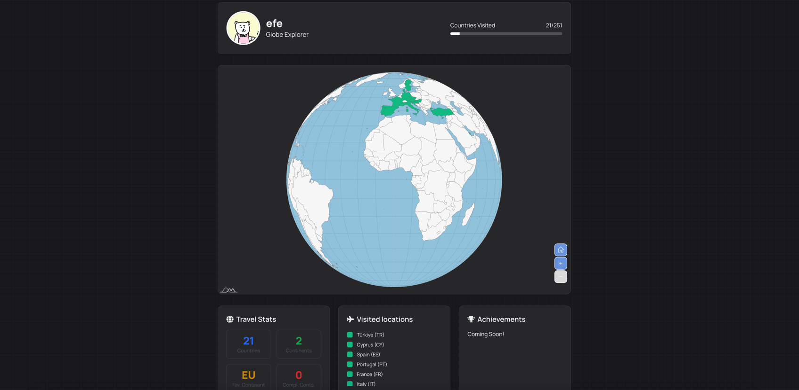

+++
title = "ferne.io - Mark Your Travels"
description = "Mark your travels on a world map, share your profile, collect achievements."
date = 2025-01-04
slug = "ferne-io"

[taxonomies]
tags = ["Projects"]

[extra]
display_published = true
+++

Update 25.01.2026: Since I'm not actively developing ferne anymore, I've moved it under https://ferne.efe.dev.

[ferne.io](https://ferne.efe.dev) is an online platform where you can mark your travels on a world map, share your profile, and collect achievements.
I **love** to travel, and I thought it would be fun to create such a platform to record my adventures.

### Idea
I initially came up with this idea because I was already using some existing solutions for tracking my travels. However, I was unhappy with how
convoluted these solutions were. I wanted something minimalistic, shareable and embeddable.

I chose the name "ferne" because in German "die Ferne" can be used to describe "the distance" or "the faraway places". It is also a play on the word [Fernweh](https://de.wikipedia.org/wiki/Fernweh), which means "a longing for far-off places".

### Goals

Besides the obvious goal of having a platform to mark my travels, I also wanted to: build a product from zero to production with [Supabase](https://supabase.com/).
I think it is an amazing technology that allows you to ship products quickly. I had limit experience with it, but their docs are well-structured. They also have a
generous free tier, which is great for small projects like this one.

### Tech Stack

- Frontend: Typescript, Nextjs, tailwindcss, shadcn/ui, amcharts

- Backend: Supabase (PostgreSQL, Auth, Storage)

### Key Features

These features were my **must-haves** for the first version of the platform:
- [x] An interactive, 3D world map to mark your travels
- [x] A profile page to share your travels (there for a user system)
- [x] An embeddable widget to show your travels on other websites (so that I can use it [in my own blog](/blog/visited-countries))

Some nice-to-have features:
- [x] Travel stats (e.g. number of countries visited)
- [x] Different types of world maps
- [x] Some customizations on marking your travels
- [ ] Achievements
- [ ] Landmarks

### Learnings

I learned a lot while building this project, especially about Supabase.
This was my first time shipping a product with it, and I was impressed by how easy it was to set up the database, authentication, and storage.
Their local development setup is also pretty good.

Through this project I got to know [amcharts](https://www.amcharts.com/) which is an extremely powerful charts & maps library.
It did take a few trials and errors to get the map working the way I wanted, but in the end it was worth it.

### Aftermath

I am still using ferne.io to mark my travels.
