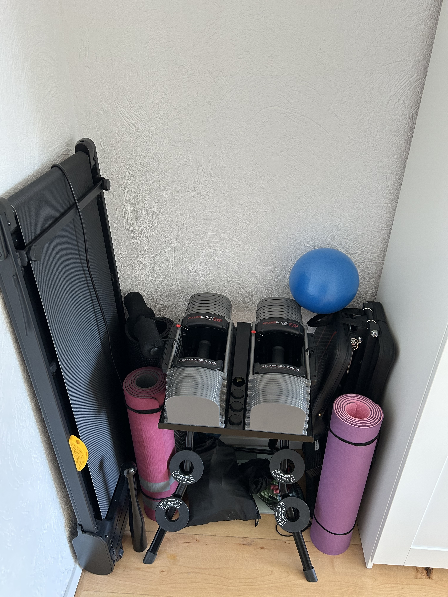

+++
title = "My tiny home gym"
description = "I friggin' love my home gym"
date = 2026-07-16
slug = "my-tiny-home-gym"

[taxonomies]
tags = ["Other"]

[extra]
display_published = true
+++

*(Yes, it's usually **not** this tidy)*

Living in a European apartment I don't have much space, but this tiny corner of my apartment gives me so much joy!
That space is about 90cm wide, but surprisingly fits everything you'd need for a good workout.
Even though I already train at a gym regularly, there's just something about being able to work out in coziness of your own home.

Now, I'm no professional, and I'm definitely not the most experienced lifter out there. 
I'd still like to share what I bought and why I bought them, hoping this might inspire someone else to build their own home gym!

### My equipment

- [Powerblock Sport 90 EXP Dumbbells](https://www.amazon.de/dp/B000XE7Q5A) and all expansion sets

Powerblocks are a set of adjustable dumbbells.

If you are sparse in space (like me), an adjustable set of dumbbells are the best choice.
About the size of a single dumbbell, you get a full rack of dumbbells. 
I specifically chose Powerblocks because:
1) I didn't want to spend too much time "adjusting" the weight, like spinlock collar dumbbells
2) It seemed sturdier than the twist lock dumbbells
3) Supports higher weights (can go up to 41kg/90lbs each with expansion sets, which I bought)
4) They look badass

That being said they do come with some downsides too:
1) Pretty pricey
2) The shape and the handles can be limiting

My only regret about Powerblocks is, that I didn't buy the [Powerblock Pros](https://powerblock.com/en-de/products/pro-100-exp-adjustable-dumbbells), which can also be used with a straight bar.
Still, I absolutely **love** my Powerblocks.

- [Powerblock Stand](https://www.amazon.de/-/en/Power-Block-Compact-Weight-Stand/dp/B01A9981M0/)

This is a stand built for Powerblocks. It has holders for the adder weights, so they don't run free. It's quite sturdy and looks nice.

I thought I could do without a stand, but quickly realized that is a no-go. 
I went this model because it's an official one, and the price is fair imo. 

- [Platemates](https://theplatemate.com/collections/the-platemate-nr/products/fractional-plates-5lb-set)

Platemates are small, magnetic plates that weigh 0.6kg each. 
I find them great for quickly micro increasing the weights.
That being said Powerblocks already offers something similar by removing adder weights, but afaik they are about 1.1kg each.

A lot of people go the DIY route for this, which is also pretty cool imo. I mostly went with Platemates for safety reasons.

- [FLYBIRD Adjustable Bench](https://www.amazon.de/-/en/FLYBIRD-Adjustable-Utility-Full-Body-Workout/dp/B07HNLBZ4Y)

I had two main criteria for my bench: must be compact, and must be adjustable (at least for incline).
This was the cheapest option that ticked the two boxes. However, I think this particular bench might be tiny for someone tall. I'm 1.80 and even for me it feels small at times.

- [Adjustable Pullup Bar](https://www.amazon.de/-/en/RHINOSPORT-rotating-adjustable-27-1-36-2-capacity/dp/B0BMQ4RXTP/)

This is an adjustable pull-up bar that you can place between your door.
I don't have this particular model or brand, but mine is very similar

A pull up bar is a must for decent back workouts. 

// todo 

// resistance bands

// indian club bell

// treadmill
