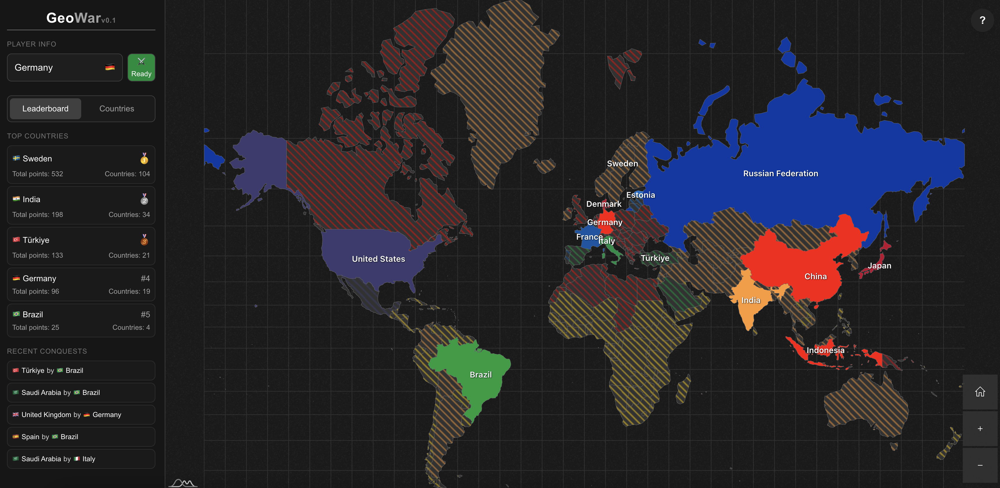

+++
title = "geowar.io - A Realtime Multiplayer Game"
description = "A realtime multiplayer game with the objective to conquer the world."
date = 2025-07-04
slug = "geowar-io"

[extra]
display_published = true
+++

[GeoWar.io](https://www.geowar.io) is a realtime multiplayer game with the goal of conquering the world.

### Idea
I used to play a great browser game called [eRepublik](https://www.erepublik.com/en). I think it is one of the best browser games I've ever played.
It inspired this idea with the theme of countries and world domination.

The name is inspired by GeoGuessr, a game where you guess locations based on street view images.

### Goals
I wanted to learn more about [Convex](https://www.convex.dev/) it is an amazing piece of technology that allows you to build realtime applications with ease.
So I finally decided to build this idea with Convex.

### Tech Stack

Typescript, React, TailwindCSS, amcharts, Convex

### Key Features
- [x] Realtime multiplayer interactions
- [x] A smooth and interactive world amp
- [x] Basic game mechanics (e.g attacking, defending, conquering)
- [x] Leaderboards and stats
- [ ] Advanced game mechanics (e.g advanced attacks, chat, alliances)

### Learnings

I learned a lot about Convex and how to build realtime applications with it.

I already used amcharts in my previous project, but I learned a lot about how to use it in a more advanced way. I built some customizations around it which made the experience smoother.

### Aftermath

I **really** enjoyed learning about Convex. I already made some contributions to their documentation while I was building this project.
I plan to more contributions to Convex in the future and use it in more projects.
