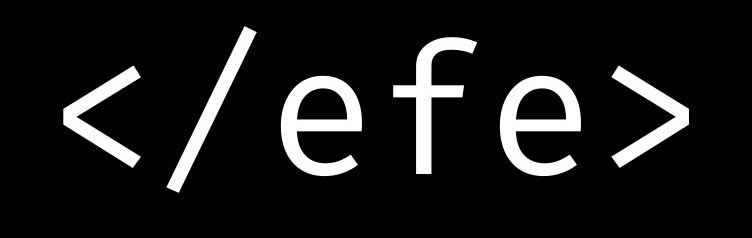

+++
title = "YouTube Channel"
description = "My YouTube channel where I share software engineering content."
date = 2025-02-25
slug = "youtube-channel"

[extra]
display_published = true
+++

[This is my YouTube channel](https://www.youtube.com/@efekarasakaldev) where I share software engineering content.

In under a year, it has reached ~5k subscribers, and over 250k views. I'm really proud of the channel and the surrounding community!

Special thanks to [JetBrains and their Content Creators Program](https://www.jetbrains.com/community/content-creators/).
I've been using their products my entire careers, and it is a great opportunity to partner with them.
